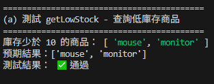
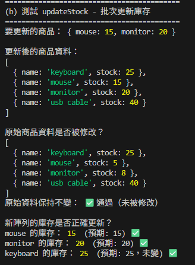
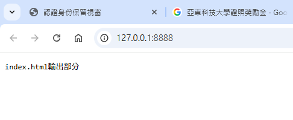
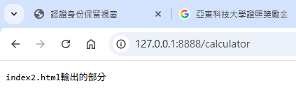
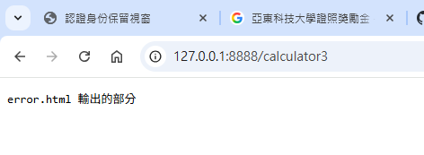
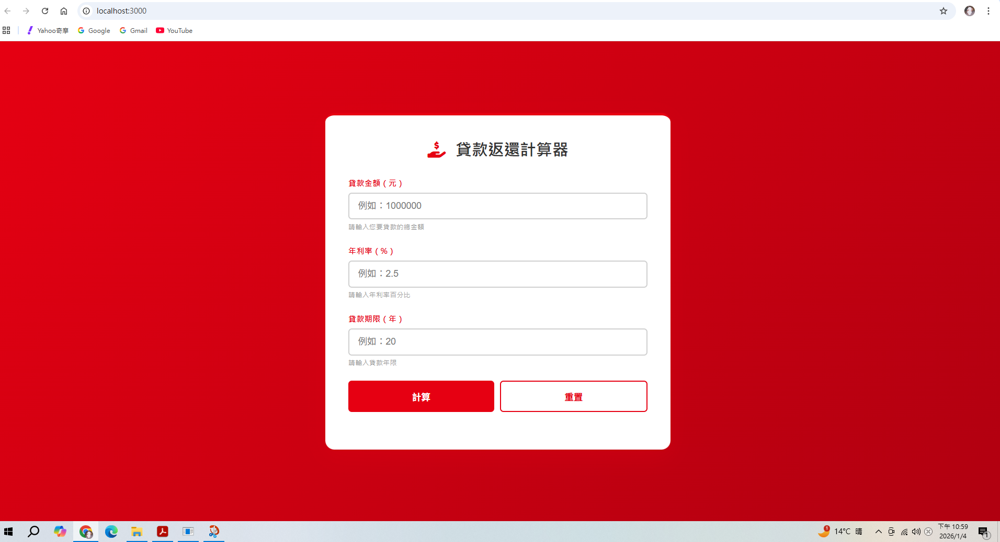
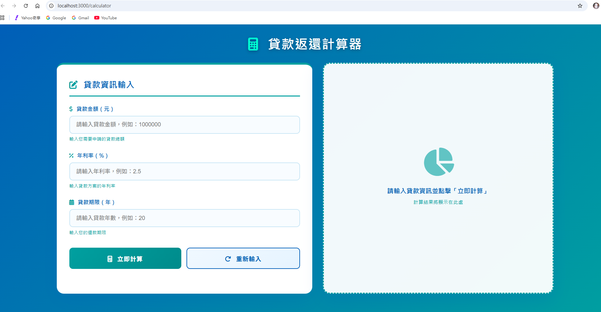
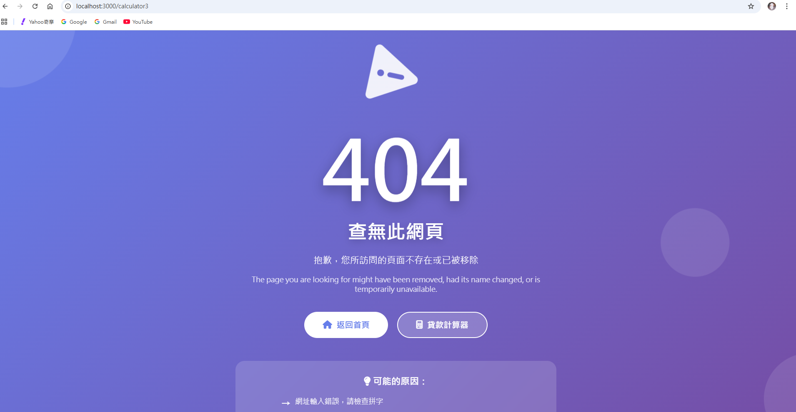

# 第2次隨堂題目-隨堂-QZ2
>
>學號：111111216  (學號和姓名都要寫)
> 
>姓名：唐滋翊

#

1. a.

Ans:
(1)陣列跟物件
(2)陣列裡面的每個元素都是物件

1. b.

Ans:
 function getLowStock(products) {
  let container = [];
  for (var i = 0; i < products.length; i++) {
    if(products[i].stock < 10) {
      container.push(products[i].name);
  }
}
  return container;
}

<!-- 請撰寫時，最後一句話再寫一次 -->

1. c.

Ans:
function updateStock(products, updates) {
  var result = [];
  for (var i = 0; i < products.length; i++) {
   var objectName = products[i].name;
   if(typeof updates[objectName] === "undefined") {
    result.push ({name: products[i].name, stock: products[i].stock});
  } else {
    result.push ({name: products[i].name, stock: updates[objectName]});
  }
}
return result;
}

<!--  請撰寫時，第一句話再寫一次  -->

2. a.

Ans:

    switch (url) {
  case '/':
    answer = 'index.html輸出部分';
  break;
  case '/calculator':
    answer = 'index2.html輸出的部分';
  break;
  default:
    answer = 'error.html 輸出的部分';
    break;
}

<!--  請撰寫時，第一句話再寫一次  -->

2. b.

Ans:
switch (req.url) {
  case '/':
    filePath = '/index.ejs';
    break
  case '/calculator':
    filePath = '/index2.ejs';
    break;
  default:
    filePath = req.url;
    fileOtherFile = req.url;
}

<!--  請撰寫時，第一句話再寫一次  -->

2. c.

Ans:
  fs.readFile(('.' + '/index3.ejs'), 'utf8', (err, template) => {

      const html = ejs.render(template);
      res.writeHead(200, { 'Content-Type': 'text/html; charset=utf-8' });
      res.end(html);
   })

<!--  請撰寫時，第一句話和最後一句再寫一次  -->

2. d.

Ans:
3次

